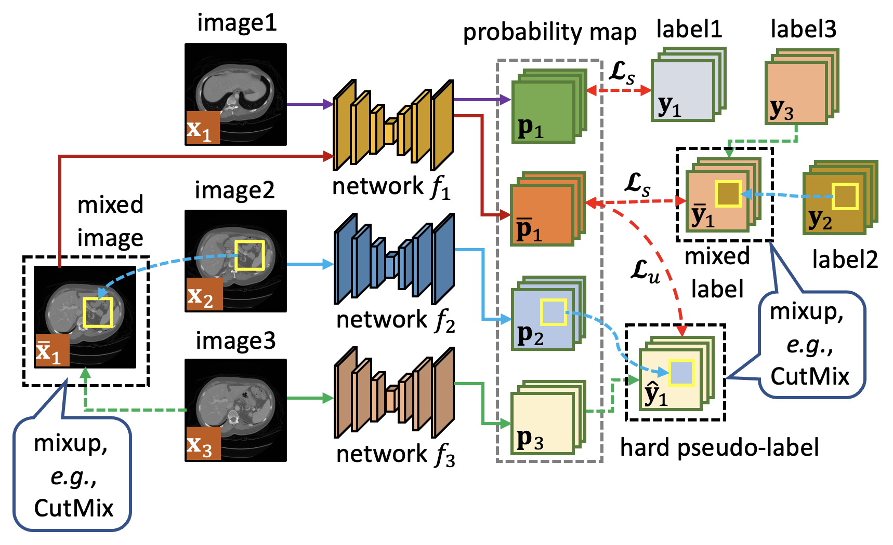

# TriMix: A General Framework for Medical Image Segmentation from Limited Supervision

## Introduction
This repository provides PyTorch implementation of our ACCV2022 paper '[TriMix: A General Framework for Medical Image Segmentation from Limited Supervision](https://openaccess.thecvf.com/content/ACCV2022/html/Zheng_TriMix_A_General_Framework_for_Medical_Image_Segmentation_from_Limited_ACCV_2022_paper.html)'.

<p align="center">
  
</p>

## Usage
### [1]. Prepare the dataset

Please follow [Luo et al.](https://github.com/HiLab-git/WSL4MIS) to prepare the ACDC dataset and put it in <u>./TriMix/semi_supervised/2D/dataset</u> and <u>./TriMix/scribble_supervised/ACDC/dataset</u>

Please follow [CycleMix](https://github.com/BWGZK/CycleMix) to prepare the MSCMRSeg dataset and put it in <u>./TriMix/scribble_supervised/MSCMR/dataset</u>

Please follow [UA-MT](https://github.com/yulequan/UA-MT) to prepare the LA dataset and put it in <u>./TriMix/semi_supervised/3D/dataset</u>

### [2]. Train and test the model:
```
python train_trimix.py
python test_trimix.py
```

## Acknowledgement
Benchmarks on ACDC, MSCMRSeg, and LA datasets in this repository borrow part of codes from [Luo et al.](https://github.com/HiLab-git/WSL4MIS), [CycleMix](https://github.com/BWGZK/CycleMix), and [UA-MT](https://github.com/yulequan/UA-MT) implementations. We also appreciate other public codebases cited in our paper.

## Note
Contact: Zhou Zheng (zzheng@mori.m.is.nagoya-u.ac.jp)